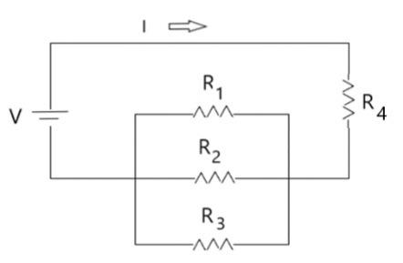
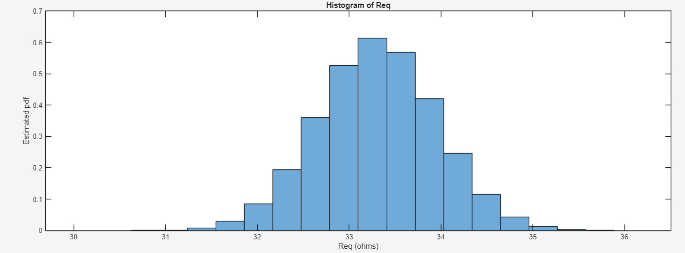
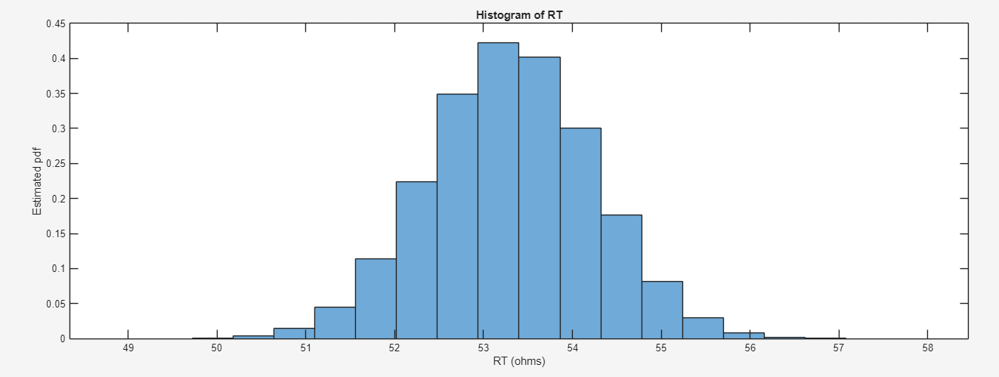

# Monte Carlo Simulation 

Components in a crcuit typically have a tolerance associated with them, and these varying values due to tolerances can cause unexpected results or failure (in the case were precision is needed). The Monte Carlo analysis provides a range of possibele results based on varying parameters measured. 

## Circuit for Analysis

The resistor network shown below has resistors R1, R2, R3, R4, which have normally distributed resistances. A battery V is also attached to the resistor network.





| Parameter Name | Mean ($\mu$)   | Standard Deviation ($\sigma$) |
|----------------|----------------|-------------------------------|
|R1              |100&#937;       |10/3                           |
|R2              |100&#937;       |10/3                           |
|R3              |100&#937;       |10/3                           |
|R4              |20&#937;        |2/3                            |
|V               |18V             |1                              |

## Theoretical RT
Resistors R1, R2, and R3 are in parallel with each other. Let’s call Req the total
resistance due to R1, R2, and R3.


$$
\begin{align*}
    R_{eq}  &= \left( \frac{1}{R_1} + \frac{1}{R_2} + \frac{1}{R_3} \right)^{-1}\\
            &=  \left( \frac{1}{100\Omega} + \frac{1}{100\Omega} + \frac{1}{100\Omega} \right)^{-1}\\
            &\approx33.33\Omega\\
    \end{align*}
$$

The total resistance of the network is then

$$
    \begin{align*}
    R_T  &=  R_{eq} + R_4\\
         &= 33.33\Omega + 20\Omega\\
         &\approx 53.33\Omega\\
    \end{align*}
$$

## Theoretical I
Since we already calculated the total resistance RT, we obtain the current through the resistor network using Ohm's Law

$$
    \begin{align*}
    I  &=  \frac{V}{R_T}\\
       &= \frac{18V}{53.33\Omega}\\
       &= 0.3375A\\
    \end{align*}
$$

## Histograms of RT and Req
Running the following code assigns R1, R2, R3, and R4 with 1x1000000 vectors filled with randomly generated values that are normally distributed
```
>> N =1000000;
>> R1 = random ( ' norm ' ,100 ,10/3 ,[1 , N ]) ;
>> R2 = random ( ' norm ' ,100 ,10/3 ,[1 , N ]) ;
>> R3 = random ( ' norm ' ,100 ,10/3 ,[1 , N ]) ;
>> R4 = random ( ' norm ' ,20 ,2/3 ,[1 , N ]) ;
```

Then vectors were generated for Req and RT using the following code
```
>> A =1./ R1 +1./ R2 +1./ R3 ;
>> Req =1./ A ;
>> RT = Req + R4 ;
```

Using the following code, histograms were generated for Req and RT
```
>> bins =20;
>> histogram ( Req , bins , ' Normalization ' , ' pdf ')
>> histogram ( RT , bins , ' Normalization ' , ' pdf ')
```



Running the following code we get some of the key statistical values of RT are the following
| Mean ($\mu$) | Std. Deviation ($\sigma$) | Minimum       | Maximum     |
|--------------|---------------------------|---------------|-------------|
| 53.3093&#937;| 0.9252                    | 48.9645&#937; |57.8524&#937;|


The x-axis includes all the Req and RT values. The y-axis has the percentage of occurrence of particular Req and RT values. 


## MATLAB Code

```
>> N =1000000;
>> R1 = random ( ' norm ' ,100 ,10/3 ,[1 , N ]) ;
>> R2 = random ( ' norm ' ,100 ,10/3 ,[1 , N ]) ;
>> R3 = random ( ' norm ' ,100 ,10/3 ,[1 , N ]) ;
>> R4 = random ( ' norm ' ,20 ,2/3 ,[1 , N ]) ;
>> A =1./ R1 +1./ R2 +1./ R3 ;
>> Req =1./ A ;
>> RT = Req + R4 ;
>>
>> prctile ( RT ,2.5)
>> prctile ( RT ,97.5)
>>
>> % A histograms for Req and RT
>> bins =20;
>> histogram ( Req , bins , ' Normalization ' , ' pdf ')
>> histogram ( RT , bins , ' Normalization ' , ' pdf ')
>> mean ( RT )
>> std ( RT )
>> min ( RT )
>> max ( RT )
>>
>> V = random ( ' norm ' ,18 ,1 ,[1 , N ]) ;
>> I = V ./ RT ;
>> mean ( I )
>> std ( I )
>> min ( I )
>> max ( I )
>> prctile (I ,2.5)
>> prctile (I ,97.5)
```


